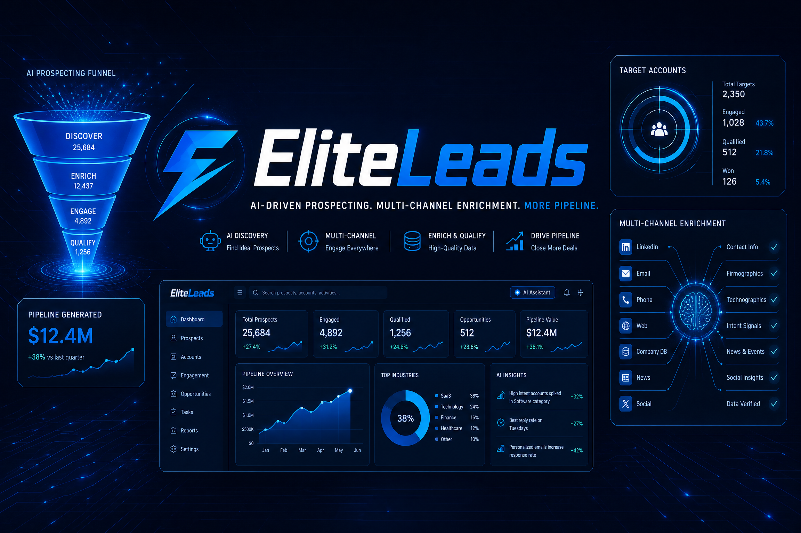

<div align="center">



# ⚡ EliteLeads
### *AI-Driven Prospecting. Multi-Channel Enrichment. More Pipeline.*

[](https://github.com/EdgeAgent/EliteLeads/stargazers)
[](https://opensource.org/licenses/MIT)
[]()

**Stop cold-calling blind.** Welcome to **EliteLeads**, an autonomous AI sales development engine designed to discover high-value prospects, enrich firmographic and intent data across multiple channels, and instantly qualify inbound leads.

</div>

---

## 🚀 Core Architectural Features

- **Autonomous Discovery:** AI-driven scraping and prospecting engines that locate ideal customer profiles (ICP) in real time.
- **Multi-Channel Enrichment:** Automatically append verified contact info, technographics, and intent signals from LinkedIn, email, and web databases.
- **Intelligent Qualification:** LLM-powered scoring agents that classify leads into hot, warm, or cold tiers and trigger automated routing.
- **CRM & Calendar Sync:** Instant bi-directional synchronization with HubSpot, Salesforce, and automated booking assistants.

---

## 📂 Repository Structure

```text
EliteLeads/
├── README.md
├── assets/
│   └── elite-leads-banner.png
├── src/
└── ...
```

---
**Author:** EDGE Agency Engineering & Manus AI
